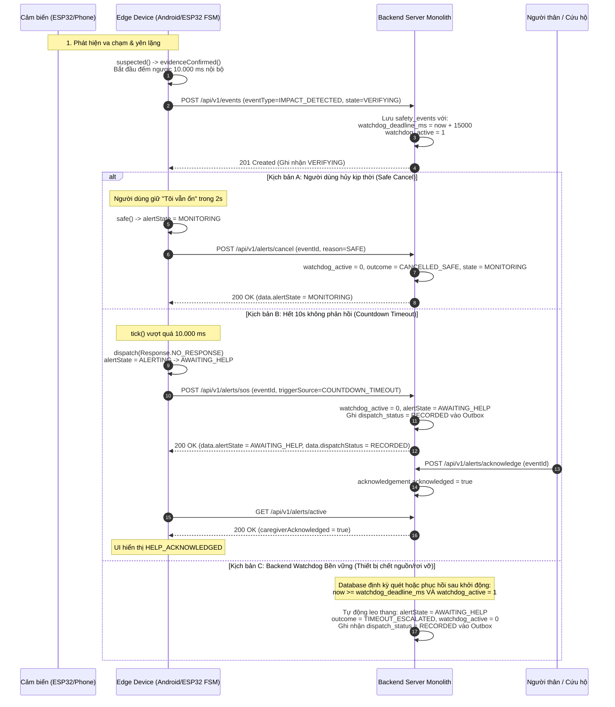

# FallSafe API Contract (v1)

> **Trạng thái:** CANONICAL REST SPECIFICATION (Chính thức duy nhất)  
> **Phiên bản API:** `v1` (Base path: `/api/v1`)  
> **Đối tượng:** Android Application, ESP32 Firmware (Wi-Fi), Backend Server  
> **Content-Type:** `application/json; charset=utf-8`

---

## 1. Nguyên tắc thiết kế và Quy ước chung

### 1.1. Nguồn chân lý duy nhất (Single Source of Truth)
Tài liệu này là đặc tả REST API chính thức duy nhất giữa Android, Backend và ESP32. Mọi định nghĩa REST trong các tài liệu khác chỉ mang tính tham chiếu và phải tuân thủ tài liệu này. Giao thức BLE GATT nhị phân (gói tin nội bộ qua Bluetooth) vẫn giữ nguyên theo `docs/interface-contract.md`.

### 1.2. Chuẩn thời gian (Timestamps)
- Toàn bộ thời gian civil/epoch trong REST payload sử dụng **Unix epoch milliseconds**: số nguyên 64-bit không âm (`timestampMs`).
- Ví dụ: `1789363200123`.
- Tên trường mang đơn vị rõ ràng: `timestampMs`, `timeoutMs`, `remainingMs`, `uptimeSeconds`, `lastHeartbeatMs`, `watchdogDeadlineMs`.
- Trong nội bộ thiết bị (Android/ESP32), đồng hồ đơn điệu (`elapsedRealtime` / `esp_timer_get_time`) được dùng để đo thời gian trôi qua cho cửa sổ đếm ngược; việc chỉnh giờ hệ thống không bao giờ được phép làm kéo dài hoặc rút ngắn thời gian đếm ngược an toàn.

### 1.3. Quy tắc định danh (Identifiers) & Ranh giới Người dùng
- `deviceId`: Chuỗi ký tự định danh thiết bị (1..128 ký tự, không rỗng, ví dụ: `FALLSAFE-01A2`, `PHONE-DEFAULT`).
- `userId`: Chuỗi ký tự định danh người dùng được giám sát (1..128 ký tự, không rỗng, ví dụ: `user-01`).
  - *Ranh giới nhận thực v1:* Phiên bản v1 xem `userId` là định danh hợp lệ phân tách dữ liệu đa người dùng trong API URL và cơ sở dữ liệu. V1 chưa tích hợp hệ thống Identity/OAuth2/JWT phức tạp; header tùy chọn `X-User-Id: <userId>` hoặc path parameter `/api/v1/users/{userId}/...` được dùng làm ranh giới dữ liệu chuẩn.
- `eventId`: Chuỗi ký tự định danh sự kiện cảnh báo (1..64 ký tự, ví dụ: `evt-1001` hoặc `1`). Trùng khớp với `AlertCore.eventId` và `Esp32EventPacket.eventId`.
- Contact `id`: Chuỗi định danh chuẩn **UUID v4** hợp lệ (`^[0-9a-f]{8}-[0-9a-f]{4}-4[0-9a-f]{3}-[89ab][0-9a-f]{3}-[0-9a-f]{12}$`, ví dụ: `3fa85f64-5717-4562-b3fc-2c963f66afa6`), tương thích trực tiếp với `EmergencyContact.id` trong Android.

### 1.4. Quy ước Nullable và Optional
- **Bắt buộc (Required)**: Trường dữ liệu phải luôn xuất hiện và có giá trị khác `null`. Nếu thiếu hoặc sai kiểu, server trả về lỗi `400 VALIDATION_ERROR`.
- **Có thể null (Nullable)**: Trường dữ liệu phải xuất hiện; giá trị có thể là `null` khi cảm biến không được trang bị, đang hiệu chuẩn hoặc không đọc được (ví dụ: `pressurePa: null`, `altitudeDeltaM: null`, `batteryVoltageMv: null`).
- **Tùy chọn (Optional)**: Trường dữ liệu có thể không xuất hiện trong request payload (ví dụ: bộ lọc truy vấn `deviceId`).

### 1.5. Cấu trúc phản hồi chuẩn (Envelope Duy Nhất)

Mọi phản hồi từ REST API (thành công hoặc thất bại) đều sử dụng envelope chuẩn thống nhất:

#### Phản hồi thành công (Success Envelope)
```json
{
  "success": true,
  "data": {
    "status": "HEALTHY"
  },
  "timestamp": 1789363200123
}
```

#### Phản hồi thất bại (Error Envelope)
```json
{
  "success": false,
  "error": {
    "code": "VALIDATION_ERROR",
    "message": "Số điện thoại không đúng định dạng VN (10 số đầu 0 hoặc +84)"
  },
  "timestamp": 1789363200123
}
```

### 1.6. Mã trạng thái HTTP (Status Codes)
- `200 OK`: Yêu cầu xử lý thành công (GET, hoặc POST/PUT mang tính cập nhật trạng thái đã có).
- `201 Created`: Tạo mới tài nguyên thành công (POST thêm liên hệ mới, tạo mới sự kiện).
- `400 Bad Request`: Lỗi dữ liệu đầu vào (`VALIDATION_ERROR`, sai định dạng JSON, vi phạm regex số điện thoại, sai UUID, dải giá trị không hợp lệ).
- `404 Not Found`: Không tìm thấy tài nguyên (`RESOURCE_NOT_FOUND`, ví dụ: `deviceId` chưa từng đăng ký, `userId` không tồn tại, contact `id` không có).
- `409 Conflict`: Xung đột trạng thái (`INVALID_STATE_TRANSITION`, trùng lặp `sequenceNumber`, hoặc vi phạm ràng buộc nghiệp vụ như xóa liên hệ duy nhất).
- `500 Internal Server Error`: Lỗi máy chủ nội bộ (`INTERNAL_SERVER_ERROR`).
- `503 Service Unavailable`: Dịch vụ tạm thời không khả dụng (`SERVICE_UNAVAILABLE`) hoặc thiết bị mục tiêu đang mất kết nối khi có thao tác bắt buộc online (`DEVICE_DISCONNECTED`).

### 1.7. Mã lỗi định danh (Error Codes)
| Mã lỗi | HTTP Code | Ý nghĩa |
|---|---:|---|
| `VALIDATION_ERROR` | 400 | Dữ liệu đầu vào sai cú pháp, thiếu trường bắt buộc, sai định dạng UUID, hoặc vượt dải cho phép. |
| `INVALID_PHONE_NUMBER` | 400 | Số điện thoại không đúng chuẩn Việt Nam (`^(\+84[35789][0-9]{8}\|0[35789][0-9]{8})$`). |
| `CANNOT_DELETE_LAST_CONTACT` | 409 | Không được xóa liên hệ duy nhất còn lại của người dùng (khi danh bạ đã có dữ liệu). |
| `RESOURCE_NOT_FOUND` | 404 | Tài nguyên được yêu cầu không tồn tại (`contact`, `device`, hoặc `event`). |
| `INVALID_STATE_TRANSITION` | 409 | Chuyển đổi trạng thái không hợp lệ (ví dụ: gửi `cancel` khi đang `MONITORING`). |
| `DUPLICATE_EVENT_ID` | 409 | `eventId` đã được ghi nhận trước đó với nội dung xung đột. |
| `DEVICE_DISCONNECTED` | 503 | Thiết bị mục tiêu mất kết nối (heartbeat quá hạn) khi yêu cầu thao tác trực tiếp. |
| `INTERNAL_SERVER_ERROR` | 500 | Lỗi xử lý backend không xác định. |
| `SERVICE_UNAVAILABLE` | 503 | Cơ sở dữ liệu hoặc thành phần lưu trữ gặp sự cố. |

### 1.8. Tính Lũy Kế Tự Nhiên (Natural Idempotency)
Thay vì hứa hẹn cơ chế khóa tùy biến chưa triển khai, contract quy định tính lũy kế tự nhiên dựa trên các khóa định danh nghiệp vụ:
1. **Dữ liệu cảm biến (`POST /sensors/ingest`):** Khóa tự nhiên `(deviceId, sequenceNumber)`. Khi nhận lại cùng bộ khóa, server coi là thao tác thành công và trả về `200 OK` ngay lập tức mà không chèn bản ghi trùng.
2. **Sự kiện an toàn (`POST /events`):** Khóa tự nhiên `eventId`. Gửi lại cùng `eventId` trả về trạng thái sự kiện hiện tại, không tạo bản ghi mới.
3. **Thao tác vòng đời cảnh báo (`/alerts/cancel`, `/alerts/sos`, `/alerts/acknowledge`, `/alerts/resolve`):** Lặp lại lệnh với cùng `eventId` sẽ trả về trạng thái hiện hành của sự kiện, không kích hoạt gửi thêm cảnh báo.
4. **Tạo danh bạ (`POST /users/{userId}/contacts`):** Client có thể cung cấp sẵn trường `id` (UUID v4 do client tạo). Nếu đã tồn tại contact cùng `(userId, id)`, server trả về bản ghi hiện có mà không tạo bản ghi mới.

---

## 2. Mô hình Máy trạng thái (State Machine & Synchronization)

### 2.1. Ánh xạ trạng thái đồng nhất (`alertState`)
Để tránh tạo bộ trạng thái thứ hai gây phân mảnh, `alertState` trên API phản ánh trực tiếp máy trạng thái miền `AlertCore.State` trong Android (`android/core/src/Core.kt`) và C++ FSM (`esp/core/local_alert.h`):

| `alertState` (API & Core) | Mô tả ngữ cảnh | Ánh xạ UI `MainScreenStatus` |
|---|---|---|
| `MONITORING` | Hệ thống đang giám sát bình thường, an toàn. | `SAFE` (nếu có kết nối) / `DEVICE_DISCONNECTED` (nếu mất kết nối) |
| `SUSPECTED` | Cảm biến phát hiện xung động/va đập bất thường ban đầu; đang kiểm chứng dấu hiệu. | `WARNING_COUNTDOWN` |
| `VERIFYING` | Bằng chứng té ngã đã xác nhận; đang mở cửa sổ đếm ngược 10 giây tại chỗ. | `WARNING_COUNTDOWN` |
| `ALERTING` | Hết 10s không phản hồi hoặc người dùng bấm SOS; đang phát tín hiệu cấp cứu. | `SOS_SENT` |
| `AWAITING_HELP` | Tín hiệu SOS đã ghi nhận vào hệ thống cứu trợ; đang chờ người thân phản hồi. | `SOS_SENT` (khi chưa ACK) / `HELP_ACKNOWLEDGED` (sau khi người thân đã nhận) |

### 2.2. Xử lý Trạng thái HỦY (Cancelled) và HOÀN TẤT (Resolved)
- Hệ thống **KHÔNG tạo state song song** như `CANCELLED` hay `RESOLVED` trong enum `alertState`.
- Khi người dùng hủy xác minh ("Tôi vẫn ổn" / Safe hold 2s):
  - `alertState` lập tức chuyển về `MONITORING`.
  - Sự kiện tương ứng lưu trữ kết quả: `outcome: "CANCELLED_SAFE"`, `response: "SAFE"`.
- Khi người thân xác nhận trợ giúp và hoàn tất phiên cứu nạn:
  - `alertState` chuyển về `MONITORING`.
  - Sự kiện tương ứng lưu trữ kết quả: `outcome: "RESOLVED_ACKNOWLEDGED"`, `status: "ACKNOWLEDGED"`.

### 2.3. Thẩm quyền đếm ngược & Bộ đếm An toàn Bền vững (Watchdog Persistence & Recovery)


- **Quy tắc Bền vững của Watchdog:**
  1. Khi nhận sự kiện `VERIFYING`, backend tính toán `watchdog_deadline_ms = nowMs + 15000` (10s đếm ngược + 5s dung sai mạng) và lưu trực tiếp vào cơ sở dữ liệu với cờ `watchdog_active = 1`.
  2. **Phục hồi sau sự cố khởi động lại (Crash/Restart Recovery):** Khi backend khởi động lại, dịch vụ watchdog lập tức chạy câu truy vấn quét:
     ```sql
     SELECT * FROM safety_events WHERE alert_state = 'VERIFYING' AND watchdog_active = 1;
     ```
     - Nếu `nowMs >= watchdog_deadline_ms`: Ngay lập tức leo thang trạng thái lên `AWAITING_HELP`, đặt `outcome = 'TIMEOUT_ESCALATED'`, `watchdog_active = 0`, ghi bản tin cảnh báo vào hàng đợi Outbox nội bộ.
     - Nếu `nowMs < watchdog_deadline_ms`: Nạp lại lịch hẹn timer cho khoảng thời gian còn lại.
  3. Quá trình quét định kỳ (mỗi 1.000 ms) đảm bảo hệ thống không bỏ sót sự kiện ngay cả khi bộ nhớ đệm tiến trình bị ngắt.

---

## 3. Mô hình Dữ liệu Hợp nhất (Unified Data Models)

### 3.1. Nguồn cảm biến (`sensorSource`)
```typescript
type SensorSource = "PHONE" | "ESP32";
```

### 3.2. Cảm biến chuẩn hóa (`SensorReading`)
```json
{
  "sensorSource": "ESP32",
  "deviceId": "FALLSAFE-01A2",
  "sequenceNumber": 18422,
  "timestampMs": 1789363200123,
  "accelXMs2": 0.31,
  "accelYMs2": -1.14,
  "accelZMs2": 9.62,
  "gyroXDps": 2.8,
  "gyroYDps": -4.1,
  "gyroZDps": 0.7,
  "pressurePa": 100842.4,
  "temperatureC": 31.2,
  "altitudeDeltaM": -0.46,
  "batteryPercent": 78,
  "batteryVoltageMv": 3970,
  "isCharging": false,
  "sosButtonPressed": false,
  "sensorQuality": 96,
  "motionState": "STATIONARY",
  "fallRisk": "LOW",
  "location": {
    "latitude": 10.776889,
    "longitude": 106.700806,
    "accuracyM": 5.0,
    "timestampMs": 1789363200000,
    "locationMessage": "123 Đường Lê Lợi, Quận 1, TP.HCM"
  }
}
```

*Ghi chú kiểu và đơn vị:*
- `sensorSource`, `deviceId`, `sequenceNumber`, `timestampMs`: metadata bắt buộc, không được `null`; kiểu và quy tắc định danh/thời gian giữ nguyên.
- `accelXMs2`, `accelYMs2`, `accelZMs2`: float (m/s²). Bắt buộc.
- `gyroXDps`, `gyroYDps`, `gyroZDps`: `number | null` (độ/giây). Cả ba trường **bắt buộc xuất hiện**, tạo thành một nhóm: ba số khi đọc được con quay hồi chuyển, hoặc cả ba `null` khi không có/không đọc được cảm biến. Không bỏ trường, không trộn số với `null`, không thay dữ liệu thiếu bằng số 0. ESP32 gửi số khi có dữ liệu; PHONE có thể gửi cả ba `null`.
- `pressurePa`: float/null (Pa).
- `temperatureC`: float/null (°C).
- `altitudeDeltaM`: float/null (mét so với mốc).
- `batteryPercent`: int (0..100). Bắt buộc.
- `batteryVoltageMv`: int/null (mV).
- `isCharging`: boolean. Bắt buộc.
- `sosButtonPressed`: boolean. Bắt buộc.
- `sensorQuality`: int (0..100). Bắt buộc.
- `motionState`: chuỗi enum tùy chọn (`STATIONARY`, `WALKING`, `RUNNING`, `FALLING`, `UNKNOWN`).
- `fallRisk`: chuỗi enum tùy chọn (`LOW`, `MEDIUM`, `HIGH`, `CRITICAL`).
- `location`: đối tượng tùy chọn, có thể là `null` nếu chưa có GPS.

Ví dụ PHONE không có con quay hồi chuyển, vẫn dùng cùng mô hình `SensorReading` và endpoint `/sensors/ingest`; `/sensors/latest` giữ nguyên ba giá trị `null`:
```json
{
  "sensorSource": "PHONE",
  "deviceId": "PHONE-DEFAULT",
  "sequenceNumber": 1,
  "timestampMs": 1789363200123,
  "accelXMs2": 0.31,
  "accelYMs2": -1.14,
  "accelZMs2": 9.62,
  "gyroXDps": null,
  "gyroYDps": null,
  "gyroZDps": null,
  "pressurePa": null,
  "temperatureC": null,
  "altitudeDeltaM": null,
  "batteryPercent": 78,
  "batteryVoltageMv": null,
  "isCharging": false,
  "sosButtonPressed": false,
  "sensorQuality": 96,
  "location": null
}
```

### 3.3. Trạng thái thiết bị (`DeviceStatus`)
Trạng thái kết nối `isConnected` là **trường suy diễn động (derived property)**: được tính bằng công thức:  
`(serverTimeMs - lastHeartbeatMs) <= HEARTBEAT_STALE_THRESHOLD_MS` (mặc định 120.000 ms / 2 phút). Database không lưu trữ cờ tĩnh này.
```json
{
  "deviceId": "FALLSAFE-01A2",
  "deviceType": "ESP32",
  "firmwareVersion": "1.0.0",
  "timestampMs": 1789363200123,
  "uptimeSeconds": 14200,
  "batteryPercent": 78,
  "batteryVoltageMv": 3970,
  "isCharging": false,
  "isConnected": true,
  "imuStatus": "OK",
  "barometerStatus": "OK",
  "gnssStatus": "UNAVAILABLE",
  "bufferUsagePercent": 12,
  "lastErrorCode": null,
  "lastHeartbeatMs": 1789363200100
}
```
*Trạng thái cảm biến:* `OK`, `CALIBRATING`, `UNAVAILABLE`, `ERROR`.

### 3.4. Sự kiện cảnh báo (`SafetyEvent`) & Trạng thái Cấp cứu
Để phản ánh trung thực năng lực hệ thống và tuân thủ quyết định D04 (không gọi/SMS thật trong giai đoạn thử nghiệm), trạng thái gửi tin ra ngoài được phân định rõ ràng bằng `dispatchStatus`:
- `NONE`: Sự kiện chưa cần phát cảnh báo (ví dụ đang `VERIFYING` hoặc đã `CANCELLED_SAFE`).
- `RECORDED`: Sự kiện SOS đã được ghi nhận an toàn vào kho lưu trữ cảnh báo (Server-side Outbox Sink).
- `PENDING_DISPATCH`: Bản tin đang chờ adapter gửi đi xử lý.
- `DISPATCHED`: Adapter ghi nhận đã chuyển thành công tới nhà cung cấp mạng (chỉ khi có nhà mạng thật).
- `FAILED`: Gặp lỗi khi ghi nhận vào Outbox.

```json
{
  "eventId": "evt-1001",
  "deviceId": "FALLSAFE-01A2",
  "userId": "user-01",
  "sequenceNumber": 18423,
  "timestampMs": 1789363200123,
  "eventType": "IMPACT_DETECTED",
  "severity": "CRITICAL",
  "alertState": "VERIFYING",
  "sensorSource": "ESP32",
  "peakAccelerationMs2": 26.4,
  "orientationChangeDeg": 68.5,
  "altitudeDeltaM": -0.85,
  "sosButtonPressed": false,
  "confidencePercent": 92,
  "outcome": "PENDING",
  "response": "UNKNOWN",
  "watchdogDeadlineMs": 1789363215123,
  "watchdogActive": true,
  "dispatchStatus": "NONE",
  "eligibleContactsCount": 0,
  "location": {
    "latitude": 10.776889,
    "longitude": 106.700806,
    "accuracyM": 5.0,
    "timestampMs": 1789363200000,
    "locationMessage": "chưa xác định được vị trí"
  },
  "acknowledgement": {
    "acknowledged": false,
    "acknowledgedBy": null,
    "acknowledgedAtMs": null,
    "note": null
  }
}
```
*Enum quy định:*
- `eventType`: `IMPACT_DETECTED`, `FREE_FALL_SUSPECTED`, `POSTURE_CHANGED`, `INSTABILITY_DETECTED`, `INACTIVITY_DETECTED`, `SOS_PRESSED`, `SOS_CANCELLED`, `LOW_BATTERY`, `SENSOR_ERROR`, `MANUAL_SOS`.
- `severity`: `INFO`, `WARNING`, `CRITICAL`.
- `alertState`: `MONITORING`, `SUSPECTED`, `VERIFYING`, `ALERTING`, `AWAITING_HELP`.
- `outcome`: `PENDING`, `CANCELLED_SAFE`, `RESOLVED_ACKNOWLEDGED`, `TIMEOUT_ESCALATED`.
- `response`: `UNKNOWN`, `SAFE`, `NEED_HELP`, `NO_RESPONSE`.
- `dispatchStatus`: `NONE`, `RECORDED`, `PENDING_DISPATCH`, `DISPATCHED`, `FAILED`.

### 3.5. Liên hệ khẩn cấp thuộc Người dùng (`EmergencyContact`)
Tương thích trực tiếp với `vn.nckh27pa.fallsafe.EmergencyContact`, có gắn kết trường sở hữu `userId`:
```json
{
  "id": "3fa85f64-5717-4562-b3fc-2c963f66afa6",
  "userId": "user-01",
  "name": "Nguyễn Thị Mai",
  "relationship": "Con gái",
  "phone": "0901234567",
  "receiveSos": true,
  "isPrimary": true
}
```

---

## 4. Chi tiết các Endpoints

### 4.1. Nhóm Trạng thái Hệ thống & Thiết bị

#### `GET /api/v1/system/status`
Kiểm tra sức khỏe backend monolith, cấu hình staleness và thời gian chuẩn.
- **Method:** `GET`
- **Request:** Trống
- **Phản hồi thành công (200 OK):**
```json
{
  "success": true,
  "data": {
    "status": "HEALTHY",
    "version": "1.0.0",
    "serverTimeMs": 1789363200123,
    "uptimeSeconds": 86400,
    "heartbeatStaleThresholdMs": 120000,
    "activeAlertsCount": 0
  },
  "timestamp": 1789363200123
}
```

#### `GET /api/v1/devices/{deviceId}/status`
Lấy trạng thái thiết bị.
- **Quy tắc phân định trạng thái rõ ràng:**
  - Nếu `deviceId` chưa từng được ghi nhận trong cơ sở dữ liệu: Trả về `404 Not Found` (`RESOURCE_NOT_FOUND`).
  - Nếu `deviceId` đã biết trong cơ sở dữ liệu:
    - Tính toán động: `isConnected = (serverTimeMs - lastHeartbeatMs) <= 120000`.
    - Trả về `200 OK` kèm `isConnected: true` (nếu còn trong hạn) hoặc `isConnected: false` (nếu đã quá hạn nhịp tim).
- **Phản hồi thành công (200 OK):**
```json
{
  "success": true,
  "data": {
    "deviceId": "FALLSAFE-01A2",
    "deviceType": "ESP32",
    "firmwareVersion": "1.0.0",
    "timestampMs": 1789363200123,
    "uptimeSeconds": 14200,
    "batteryPercent": 78,
    "batteryVoltageMv": 3970,
    "isCharging": false,
    "isConnected": true,
    "imuStatus": "OK",
    "barometerStatus": "OK",
    "gnssStatus": "UNAVAILABLE",
    "bufferUsagePercent": 12,
    "lastErrorCode": null,
    "lastHeartbeatMs": 1789363200100
  },
  "timestamp": 1789363200123
}
```
- **Lỗi:**
  - `404 Not Found` (`RESOURCE_NOT_FOUND`): Khi không tìm thấy thiết bị.

#### `POST /api/v1/devices/{deviceId}/status`
ESP32 hoặc Android định kỳ phát nhịp tim (heartbeat) cập nhật pin và trạng thái phần cứng.
- **Method:** `POST`
- **Path parameter:** `deviceId`
- **Request Body:**
```json
{
  "firmwareVersion": "1.0.0",
  "timestampMs": 1789363200123,
  "uptimeSeconds": 14200,
  "batteryPercent": 78,
  "batteryVoltageMv": 3970,
  "isCharging": false,
  "imuStatus": "OK",
  "barometerStatus": "OK",
  "gnssStatus": "UNAVAILABLE",
  "bufferUsagePercent": 12,
  "lastErrorCode": null
}
```
- **Phản hồi thành công (200 OK):**
```json
{
  "success": true,
  "data": {
    "deviceId": "FALLSAFE-01A2",
    "recorded": true,
    "serverTimeMs": 1789363200123
  },
  "timestamp": 1789363200123
}
```
- **Side effects:** Cập nhật hoặc chèn bản ghi thiết bị, gán `last_heartbeat_ms = nowMs`. Nếu pin yếu (< 15%), tự động tạo sự kiện `LOW_BATTERY` mức `WARNING`.

---

### 4.2. Nhóm Dữ liệu Cảm biến

#### `POST /api/v1/sensors/ingest`
Tiếp nhận gói tin cảm biến từ ESP32 (qua Wi-Fi) hoặc từ điện thoại Android.
- **Method:** `POST`
- **Request Body:** Đối tượng `SensorReading` (xem mục 3.2).
- **Phản hồi thành công (200 OK):**
```json
{
  "success": true,
  "data": {
    "deviceId": "FALLSAFE-01A2",
    "sequenceNumber": 18422,
    "stored": true
  },
  "timestamp": 1789363200123
}
```
- **Idempotency:** Trùng `(deviceId, sequenceNumber)` được coi là gửi lặp, trả về `200 OK` ngay lập tức mà không chèn trùng.

#### `GET /api/v1/sensors/latest`
Lấy mẫu cảm biến gần nhất của một thiết bị.
- **Method:** `GET`
- **Query parameters:** `deviceId` (bắt buộc).
- **Ví dụ:** `/api/v1/sensors/latest?deviceId=FALLSAFE-01A2`
- **Phản hồi thành công (200 OK):**
```json
{
  "success": true,
  "data": {
    "sensorSource": "ESP32",
    "deviceId": "FALLSAFE-01A2",
    "sequenceNumber": 18422,
    "timestampMs": 1789363200123,
    "accelXMs2": 0.31,
    "accelYMs2": -1.14,
    "accelZMs2": 9.62,
    "gyroXDps": 2.8,
    "gyroYDps": -4.1,
    "gyroZDps": 0.7,
    "pressurePa": 100842.4,
    "temperatureC": 31.2,
    "altitudeDeltaM": -0.46,
    "batteryPercent": 78,
    "batteryVoltageMv": 3970,
    "isCharging": false,
    "sosButtonPressed": false,
    "sensorQuality": 96,
    "location": null
  },
  "timestamp": 1789363200123
}
```

---

### 4.3. Nhóm Sự kiện Cảnh báo & Đọc Lịch sử

#### `POST /api/v1/events`
Ghi nhận sự kiện bất thường từ thuật toán phát hiện ngã (Edge) hoặc nút bấm phần cứng.
- **Method:** `POST`
- **Request Body:**
```json
{
  "eventId": "evt-1001",
  "deviceId": "FALLSAFE-01A2",
  "userId": "user-01",
  "sequenceNumber": 18423,
  "timestampMs": 1789363200123,
  "eventType": "IMPACT_DETECTED",
  "severity": "CRITICAL",
  "alertState": "VERIFYING",
  "sensorSource": "ESP32",
  "peakAccelerationMs2": 26.4,
  "orientationChangeDeg": 68.5,
  "altitudeDeltaM": -0.85,
  "sosButtonPressed": false,
  "confidencePercent": 92,
  "location": {
    "latitude": 10.776889,
    "longitude": 106.700806,
    "accuracyM": 5.0,
    "timestampMs": 1789363200000,
    "locationMessage": "123 Đường Lê Lợi, Quận 1, TP.HCM"
  }
}
```
- **Phản hồi thành công (201 Created):**
```json
{
  "success": true,
  "data": {
    "eventId": "evt-1001",
    "alertState": "VERIFYING",
    "active": true,
    "watchdogDeadlineMs": 1789363215123
  },
  "timestamp": 1789363200123
}
```
- **Side effects:** Lưu sự kiện vào `safety_events`, đặt `watchdog_deadline_ms = nowMs + 15000` và `watchdog_active = 1`.
- **Idempotency:** Trùng `eventId` trả về bản ghi hiện hữu (200 OK), không tạo bản sao.

#### `GET /api/v1/events`
Lấy danh sách các sự kiện gần đây.
- **Method:** `GET`
- **Query parameters:**
  - `userId` (chuỗi, tùy chọn): lọc theo người dùng.
  - `deviceId` (chuỗi, tùy chọn): lọc theo thiết bị.
  - `limit` (số nguyên, tùy chọn, mặc định 32, tối đa 100).
- **Phản hồi thành công (200 OK):**
```json
{
  "success": true,
  "data": {
    "events": [
      {
        "eventId": "evt-1001",
        "deviceId": "FALLSAFE-01A2",
        "userId": "user-01",
        "timestampMs": 1789363200123,
        "eventType": "IMPACT_DETECTED",
        "severity": "CRITICAL",
        "alertState": "VERIFYING",
        "outcome": "PENDING"
      }
    ]
  },
  "timestamp": 1789363200123
}
```

#### `GET /api/v1/events/{eventId}`
Lấy chi tiết một sự kiện cụ thể.
- **Method:** `GET`
- **Path parameter:** `eventId`
- **Phản hồi thành công (200 OK):** Trả về toàn bộ đối tượng `SafetyEvent` (xem mục 3.4).
- **Lỗi:** `404 Not Found` nếu không tìm thấy `eventId`.

---

### 4.4. Nhóm Vòng đời Cảnh báo (Alert Lifecycle & Action Endpoints)

#### `GET /api/v1/alerts/active`
Lấy trạng thái cảnh báo đang hoạt động của thiết bị hoặc người dùng.
- **Method:** `GET`
- **Query parameters:** `deviceId` hoặc `userId` (bắt buộc ít nhất một tham số).
- **Ví dụ:** `/api/v1/alerts/active?userId=user-01`
- **Phản hồi thành công (200 OK):**
```json
{
  "success": true,
  "data": {
    "userId": "user-01",
    "deviceId": "FALLSAFE-01A2",
    "alertState": "VERIFYING",
    "activeEventId": "evt-1001",
    "remainingMs": 6500,
    "response": "UNKNOWN",
    "caregiverAcknowledged": false,
    "lastUpdatedMs": 1789363203500
  },
  "timestamp": 1789363200123
}
```

#### `POST /api/v1/alerts/sos`
Kích hoạt SOS khẩn cấp tức thì (do nhấn nút SOS 3 giây trên app, hoặc do hết 10 giây đếm ngược tại chỗ mà không phản hồi).
- **Method:** `POST`
- **Request Body:**
```json
{
  "deviceId": "FALLSAFE-01A2",
  "userId": "user-01",
  "eventId": "evt-1001",
  "timestampMs": 1789363210123,
  "triggerSource": "COUNTDOWN_TIMEOUT",
  "response": "NO_RESPONSE",
  "location": {
    "latitude": 10.776889,
    "longitude": 106.700806,
    "accuracyM": 5.0,
    "timestampMs": 1789363210000,
    "locationMessage": "chưa xác định được vị trí"
  }
}
```
*Các giá trị `triggerSource`:* `COUNTDOWN_TIMEOUT`, `MANUAL_APP_BUTTON`, `MANUAL_HARDWARE_BUTTON`.  
*Các giá trị `response`:* `NO_RESPONSE` (khi timeout), `NEED_HELP` (khi bấm tay SOS).
- **Phản hồi thành công (200 OK):**
```json
{
  "success": true,
  "data": {
    "eventId": "evt-1001",
    "alertState": "AWAITING_HELP",
    "dispatchStatus": "RECORDED",
    "eligibleContactsCount": 2,
    "recordedAtMs": 1789363210150
  },
  "timestamp": 1789363210150
}
```
*Ghi chú an toàn:* 
- `dispatchStatus: "RECORDED"` thể hiện sự kiện đã được lưu an toàn vào cơ sở dữ liệu và Outbox Sink phía máy chủ. Hệ thống không báo sai `SENT` khi chưa có nhà mạng viễn thông thật gửi tin (tuân thủ D04).
- `eligibleContactsCount`: Số lượng liên hệ của `userId` có cấu hình `receiveSos: true` đủ điều kiện nhận tin.

#### `POST /api/v1/alerts/cancel`
Hủy cảnh báo an toàn khi người dùng xác nhận "Tôi vẫn ổn" trong thời gian đếm ngược 10s.
- **Method:** `POST`
- **Request Body:**
```json
{
  "deviceId": "FALLSAFE-01A2",
  "userId": "user-01",
  "eventId": "evt-1001",
  "timestampMs": 1789363204200,
  "reason": "SAFE",
  "note": "Người dùng đã giữ nút 'Tôi vẫn ổn' trong 2 giây"
}
```
- **Phản hồi thành công (200 OK):**
```json
{
  "success": true,
  "data": {
    "eventId": "evt-1001",
    "alertState": "MONITORING",
    "outcome": "CANCELLED_SAFE",
    "cancelledAtMs": 1789363204220
  },
  "timestamp": 1789363204220
}
```
- **Side effects:** Đặt `watchdog_active = 0`, cập nhật `outcome = 'CANCELLED_SAFE'`, chuyển `alertState` về `MONITORING`.

#### `POST /api/v1/alerts/acknowledge`
Người thân / người chăm sóc xác nhận đã nhận được thông tin khẩn cấp và đang tiến hành hỗ trợ.
- **Method:** `POST`
- **Request Body:**
```json
{
  "eventId": "evt-1001",
  "acknowledgedBy": "Nguyễn Thị Mai (Con gái)",
  "timestampMs": 1789363225000,
  "note": "Đang gọi điện kiểm tra cụ"
}
```
- **Phản hồi thành công (200 OK):**
```json
{
  "success": true,
  "data": {
    "eventId": "evt-1001",
    "alertState": "AWAITING_HELP",
    "caregiverAcknowledged": true,
    "acknowledgedAtMs": 1789363225000
  },
  "timestamp": 1789363225000
}
```
*Lưu ý:* Việc người thân phản hồi (ACK) là độc lập với việc nhà mạng truyền tin (dispatch).

#### `POST /api/v1/alerts/resolve`
Hoàn tất đợt cảnh báo khẩn cấp, đưa toàn bộ hệ thống về trạng thái bình thường.
- **Method:** `POST`
- **Request Body:**
```json
{
  "eventId": "evt-1001",
  "resolvedBy": "Nguyễn Thị Mai",
  "timestampMs": 1789363300000,
  "resolutionNote": "Cụ đã an toàn, chỉ bị trượt chân nhẹ"
}
```
- **Phản hồi thành công (200 OK):**
```json
{
  "success": true,
  "data": {
    "eventId": "evt-1001",
    "alertState": "MONITORING",
    "outcome": "RESOLVED_ACKNOWLEDGED",
    "resolvedAtMs": 1789363300000
  },
  "timestamp": 1789363300000
}
```

---

### 4.5. Nhóm Quản lý Danh bạ Khẩn cấp theo Người dùng (`/api/v1/users/{userId}/contacts`)

Toàn bộ các thao tác danh bạ được đóng khung theo phạm vi người dùng (`userId`), đảm bảo tính nhất quán sở hữu dữ liệu và không tạo mô hình user song song:

#### `GET /api/v1/users/{userId}/contacts`
Lấy danh sách liên hệ khẩn cấp của người dùng.
- **Method:** `GET`
- **Path parameter:** `userId`
- **Phản hồi thành công (200 OK):**
```json
{
  "success": true,
  "data": {
    "userId": "user-01",
    "contacts": [
      {
        "id": "3fa85f64-5717-4562-b3fc-2c963f66afa6",
        "userId": "user-01",
        "name": "Nguyễn Thị Mai",
        "relationship": "Con gái",
        "phone": "0901234567",
        "receiveSos": true,
        "isPrimary": true
      },
      {
        "id": "8b1e102e-9cf4-4b53-b2fa-1014a66a1a11",
        "userId": "user-01",
        "name": "Nguyễn Văn Tuấn",
        "relationship": "Con trai",
        "phone": "0912345678",
        "receiveSos": true,
        "isPrimary": false
      }
    ]
  },
  "timestamp": 1789363200123
}
```

#### `POST /api/v1/users/{userId}/contacts`
Thêm mới một liên hệ khẩn cấp cho người dùng.
- **Method:** `POST`
- **Path parameter:** `userId`
- **Request Body:**
```json
{
  "id": "e2c8153e-51c3-4c96-857e-07e155bc7329",
  "name": "Bác sĩ Hùng",
  "relationship": "Bác sĩ gia đình",
  "phone": "0987654321",
  "receiveSos": true,
  "isPrimary": false
}
```
*Ghi chú:* `id` là tùy chọn; nếu client không gửi, server sẽ tự tạo UUID v4 chuẩn.
- **Quy tắc kiểm tra & Bất biến:**
  1. `name`: Chuỗi không rỗng, tối đa 100 ký tự.
  2. `phone`: Chuẩn hóa bằng cách loại bỏ ký tự trắng, dấu gạch nối, chấm, ngoặc đơn. Bắt buộc phải khớp regex số điện thoại Việt Nam: `^(\+84[35789][0-9]{8}|0[35789][0-9]{8})$`.
  3. `isPrimary`: Nếu là liên hệ đầu tiên được thêm vào danh bạ của `userId`, liên hệ này **luôn tự động nhận `isPrimary = true`**. Nếu thêm liên hệ mới với `isPrimary = true`, các liên hệ cũ của `userId` tự động chuyển về `isPrimary = false`.
- **Phản hồi thành công (201 Created):**
```json
{
  "success": true,
  "data": {
    "contact": {
      "id": "e2c8153e-51c3-4c96-857e-07e155bc7329",
      "userId": "user-01",
      "name": "Bác sĩ Hùng",
      "relationship": "Bác sĩ gia đình",
      "phone": "0987654321",
      "receiveSos": true,
      "isPrimary": false
    }
  },
  "timestamp": 1789363200123
}
```
- **Lỗi:**
  - `400 Bad Request` (`INVALID_PHONE_NUMBER`): Số điện thoại sai chuẩn Việt Nam.
  - `400 Bad Request` (`VALIDATION_ERROR`): Sai định dạng UUID hoặc tên rỗng.

#### `PUT /api/v1/users/{userId}/contacts/{id}`
Cập nhật thông tin một liên hệ khẩn cấp.
- **Method:** `PUT`
- **Path parameters:** `userId`, `id` (UUID v4)
- **Request Body:**
```json
{
  "name": "Nguyễn Thị Mai",
  "relationship": "Con gái trưởng",
  "phone": "0901234567",
  "receiveSos": true,
  "isPrimary": true
}
```
- **Quy tắc:** Nếu cập nhật `isPrimary: true`, toàn bộ các liên hệ khác của `userId` tự động chuyển `isPrimary: false`. Nếu chuyển `isPrimary: false` mà không còn ai là primary, hệ thống giữ nguyên người này là primary.
- **Phản hồi thành công (200 OK):** Trả về đối tượng contact đã cập nhật.
- **Lỗi:**
  - `404 Not Found` (`RESOURCE_NOT_FOUND`): Không tìm thấy liên hệ `id` thuộc `userId`.

#### `DELETE /api/v1/users/{userId}/contacts/{id}`
Xóa một liên hệ khẩn cấp.
- **Method:** `DELETE`
- **Path parameters:** `userId`, `id`
- **Quy tắc bất biến:**
  - **Quy tắc bảo vệ liên hệ cuối cùng:** Khi danh bạ của `userId` đã có ít nhất 1 liên hệ, nếu chỉ còn lại đúng 1 liên hệ (`contacts.length <= 1`), thao tác xóa **BẮT BUỘC BỊ TỪ CHỐI** với mã lỗi `409 CANNOT_DELETE_LAST_CONTACT`. *(Cơ sở dữ liệu trống khởi đầu vẫn hợp lệ trước khi liên hệ đầu tiên được thêm)*.
  - **Quy tắc bảo toàn liên hệ chính:** Nếu xóa liên hệ đang giữ `isPrimary: true`, liên hệ đầu tiên trong danh sách còn lại sẽ tự động được chỉ định làm `isPrimary: true`.
- **Phản hồi thành công (200 OK):**
```json
{
  "success": true,
  "data": {
    "deletedId": "8b1e102e-9cf4-4b53-b2fa-1014a66a1a11",
    "remainingCount": 1
  },
  "timestamp": 1789363200123
}
```
- **Lỗi:**
  - `409 Conflict` (`CANNOT_DELETE_LAST_CONTACT`): `"Không thể xóa liên hệ khẩn cấp duy nhất còn lại của người dùng"`.
  - `404 Not Found` (`RESOURCE_NOT_FOUND`): Không tìm thấy `id` thuộc `userId`.

#### `POST /api/v1/users/{userId}/contacts/{id}/primary`
Chỉ định một liên hệ làm người liên hệ chính (Primary).
- **Method:** `POST`
- **Path parameters:** `userId`, `id`
- **Phản hồi thành công (200 OK):**
```json
{
  "success": true,
  "data": {
    "primaryContactId": "8b1e102e-9cf4-4b53-b2fa-1014a66a1a11",
    "updated": true
  },
  "timestamp": 1789363200123
}
```

#### `POST /api/v1/users/{userId}/contacts/{id}/toggle-sos`
Bật/tắt cờ `receiveSos` của liên hệ.
- **Method:** `POST`
- **Path parameters:** `userId`, `id`
- **Phản hồi thành công (200 OK):**
```json
{
  "success": true,
  "data": {
    "id": "3fa85f64-5717-4562-b3fc-2c963f66afa6",
    "receiveSos": false
  },
  "timestamp": 1789363200123
}
```

---

## 5. Hành vi Ngoại tuyến, Thử lại và Ranh giới Bảo mật

### 5.1. Bộ đệm ngoại tuyến (Offline Buffering) & Chiến lược thử lại (Retry Policy)
1. Khi mất kết nối Internet:
   - Android và ESP32 tiếp tục đo đạc và chạy máy trạng thái tại chỗ (`PHONE_ONLY` hoặc `LocalAlertStateMachine`).
   - Cảnh báo âm thanh/còi rung tại chỗ luôn chạy độc lập với kết nối mạng.
   - Các gói tin cảm biến và sự kiện được ghi vào bộ đệm vòng (Ring Buffer) cục bộ.
2. Khi kết nối Internet phục hồi:
   - Client gửi các sự kiện ưu tiên (`CRITICAL`, `SOS_PRESSED`, `IMPACT_DETECTED`) trước các mẫu cảm biến thông thường.
   - Thử lại theo Exponential Backoff: `1s, 2s, 4s, 8s, ...` đến tối đa `30s` kèm `jitter ±20%`.

### 5.2. Ranh giới Bảo mật và Nhận thực (Security Boundary)
- Phiên bản v1 tập trung hoàn thiện giao tiếp đo đạc, kiểm chứng và tính năng an toàn.
- **Không hardcode thông tin nhạy cảm trong mã nguồn.**
- Nhận thực thiết bị sử dụng Header HTTP tiêu chuẩn:
  - `X-Device-Id: <deviceId>`
  - `X-User-Id: <userId>` (Tùy chọn)
  - `X-Api-Key: <apiKey>` (Tùy chọn cấu hình môi trường; backend v1 cho phép chế độ `AUTH_DISABLED=true` trong môi trường kiểm thử nội bộ).

---

## 6. Đặc tả Kiến trúc Backend Monolith (Quyết định Triển khai D05)

### 6.1. Quyết định Công nghệ: Zero-Dependency Node.js Built-ins
Qua kiểm tra môi trường máy chủ cục bộ (`node v26.8.2`, `sqlite3` có sẵn), Backend Monolith được chốt triển khai bằng **Node.js (v26) thuần sử dụng hoàn toàn thư viện có sẵn (Built-in Modules)**:
- **Web Server:** `node:http` (siêu nhẹ, không rủi ro bảo mật bên ngoài, không cần cài đặt thêm gói npm nào).
- **Cơ sở dữ liệu:** `node:sqlite` (`DatabaseSync` - tích hợp trực tiếp trong Node v26).
- **Bộ kiểm thử TDD:** `node:test` và `node:assert` (tốc độ chạy toàn bộ test suite < 50ms).
- **Phụ thuộc gói ngoài (`package.json`):** `dependencies: {}` — **ZERO DEPENDENCIES**.

### 6.2. Cấu trúc Phân tầng (Layered Architecture)
```
backend/
├── package.json               # dependencies rỗng, scripts: test, start
├── src/
│   ├── config.js              # Cấu hình môi trường (PORT, HOST, DB_PATH, STALE_THRESHOLD, TIMEOUT)
│   ├── app.js                 # Entrypoint tạo HTTP server từ routes
│   ├── routes/                # Dispatcher URL và phương thức HTTP
│   │   ├── systemRoutes.js
│   │   ├── deviceRoutes.js
│   │   ├── sensorRoutes.js
│   │   ├── alertRoutes.js
│   │   └── contactRoutes.js
│   ├── controllers/           # Trích xuất request params, định dạng envelope chuẩn
│   │   ├── systemController.js
│   │   ├── deviceController.js
│   │   ├── sensorController.js
│   │   ├── alertController.js
│   │   └── contactController.js
│   ├── services/              # Logic nghiệp vụ, máy trạng thái, watchdog scanner, validation
│   │   ├── alertStateMachine.js # FSM, watchdog scanner định kỳ và startup recovery
│   │   ├── alertOutboxService.js # Server-side outbox sink (D04 compliant)
│   │   ├── contactService.js    # Bất biến danh bạ, validate phone VN
│   │   ├── deviceService.js     # Suy diễn trạng thái isConnected dựa trên staleness
│   │   └── sensorService.js     # Chống trùng sequence, cập nhật vị trí
│   └── repositories/          # Tương tác cơ sở dữ liệu SQLite
│       ├── db.js              # Kết nối SQLite & chạy migration
│       ├── deviceRepository.js
│       ├── sensorRepository.js
│       ├── eventRepository.js
│       ├── contactRepository.js
│       └── outboxRepository.js
├── migrations/
│   └── 001_initial_schema.sql # DDL khởi tạo bảng
└── test/
    ├── helpers.js             # Bộ fixture test in-memory
    ├── system.test.js
    ├── devices.test.js
    ├── sensors.test.js
    ├── events_watchdog.test.js
    ├── alerts_lifecycle.test.js
    └── contacts_crud.test.js
```

### 6.3. Thiết kế Bảng Cơ sở dữ liệu (SQLite DDL)

```sql
-- 1. Bảng Thiết bị
-- Lưu ý: isConnected là trường suy diễn động từ last_heartbeat_ms, không lưu cờ tĩnh trong bảng
CREATE TABLE IF NOT EXISTS devices (
    device_id TEXT PRIMARY KEY,
    device_type TEXT NOT NULL DEFAULT 'ESP32',
    firmware_version TEXT,
    battery_percent INTEGER,
    battery_voltage_mv INTEGER,
    is_charging INTEGER DEFAULT 0,
    imu_status TEXT DEFAULT 'OK',
    barometer_status TEXT DEFAULT 'OK',
    gnss_status TEXT DEFAULT 'UNAVAILABLE',
    buffer_usage_percent INTEGER DEFAULT 0,
    last_error_code TEXT,
    last_heartbeat_ms INTEGER NOT NULL
);

-- 2. Bảng Dữ liệu Cảm biến gần nhất & Lịch sử
CREATE TABLE IF NOT EXISTS sensor_readings (
    id INTEGER PRIMARY KEY AUTOINCREMENT,
    device_id TEXT NOT NULL,
    sensor_source TEXT NOT NULL,
    sequence_number INTEGER NOT NULL,
    timestamp_ms INTEGER NOT NULL,
    accel_x_ms2 REAL NOT NULL,
    accel_y_ms2 REAL NOT NULL,
    accel_z_ms2 REAL NOT NULL,
    gyro_x_dps REAL,
    gyro_y_dps REAL,
    gyro_z_dps REAL,
    pressure_pa REAL,
    temperature_c REAL,
    altitude_delta_m REAL,
    battery_percent INTEGER NOT NULL,
    battery_voltage_mv INTEGER,
    is_charging INTEGER NOT NULL,
    sos_button_pressed INTEGER NOT NULL,
    sensor_quality INTEGER NOT NULL,
    latitude REAL,
    longitude REAL,
    accuracy_m REAL,
    location_message TEXT,
    UNIQUE(device_id, sequence_number)
);

-- 3. Bảng Sự kiện Cảnh báo & Vòng đời Sự cố
CREATE TABLE IF NOT EXISTS safety_events (
    event_id TEXT PRIMARY KEY,
    device_id TEXT NOT NULL,
    user_id TEXT NOT NULL,
    sequence_number INTEGER NOT NULL,
    timestamp_ms INTEGER NOT NULL,
    event_type TEXT NOT NULL,
    severity TEXT NOT NULL,
    alert_state TEXT NOT NULL,
    sensor_source TEXT NOT NULL,
    peak_acceleration_ms2 REAL,
    orientation_change_deg REAL,
    altitude_delta_m REAL,
    sos_button_pressed INTEGER NOT NULL,
    confidence_percent INTEGER NOT NULL,
    outcome TEXT NOT NULL DEFAULT 'PENDING',
    response TEXT NOT NULL DEFAULT 'UNKNOWN',
    watchdog_deadline_ms INTEGER,
    watchdog_active INTEGER NOT NULL DEFAULT 0,
    dispatch_status TEXT NOT NULL DEFAULT 'NONE',
    eligible_contacts_count INTEGER NOT NULL DEFAULT 0,
    latitude REAL,
    longitude REAL,
    accuracy_m REAL,
    location_message TEXT,
    acknowledged INTEGER DEFAULT 0,
    acknowledged_by TEXT,
    acknowledged_at_ms INTEGER,
    acknowledgement_note TEXT,
    created_at_ms INTEGER NOT NULL,
    updated_at_ms INTEGER NOT NULL
);

-- 4. Bảng Danh bạ Khẩn cấp theo Người dùng
CREATE TABLE IF NOT EXISTS emergency_contacts (
    id TEXT NOT NULL,
    user_id TEXT NOT NULL,
    name TEXT NOT NULL,
    relationship TEXT NOT NULL,
    phone TEXT NOT NULL,
    receive_sos INTEGER NOT NULL DEFAULT 1,
    is_primary INTEGER NOT NULL DEFAULT 0,
    PRIMARY KEY (user_id, id)
);
CREATE INDEX IF NOT EXISTS idx_contacts_user_id ON emergency_contacts(user_id);

-- 5. Bảng Outbox Cảnh báo An toàn Phía Máy chủ (Server-side Sink)
CREATE TABLE IF NOT EXISTS alert_outbox (
    id INTEGER PRIMARY KEY AUTOINCREMENT,
    event_id TEXT NOT NULL,
    user_id TEXT NOT NULL,
    contact_id TEXT NOT NULL,
    contact_name TEXT NOT NULL,
    phone TEXT NOT NULL,
    message_content TEXT NOT NULL,
    status TEXT NOT NULL DEFAULT 'RECORDED',
    created_at_ms INTEGER NOT NULL,
    dispatched_at_ms INTEGER
);
```

### 6.4. Nguyên tắc Cơ sở Dữ liệu Trống khi Khởi chạy (No Production Seed Data)
- **Cơ sở dữ liệu vận hành khi khởi động lần đầu HOÀN TOÀN TRỐNG (Clean State).**
- Nghiêm cấm gài cắm người giả, danh bạ giả, hoặc thiết bị giả vào cơ sở dữ liệu production.
- **Dữ liệu mẫu kiểm thử (Test Fixtures):** Chỉ được tạo và chèn trong môi trường kiểm thử tự động (`NODE_ENV=test`) hoặc trong bộ fixture test chuyên biệt (`test/helpers.js`).
- Ràng buộc "không được xóa liên hệ duy nhất" được kích hoạt ngay khi liên hệ đầu tiên được tạo cho người dùng tương ứng.

### 6.5. Cấu hình Môi trường Tập trung
Tất cả các tham số vận hành được quản lý tại một điểm duy nhất (`src/config.js`):
```javascript
module.exports = {
  PORT: parseInt(process.env.PORT, 10) || 3000,
  HOST: process.env.HOST || '0.0.0.0',
  DB_PATH: process.env.DB_PATH || './data/fallsafe.db',
  COUNTDOWN_TIMEOUT_MS: parseInt(process.env.COUNTDOWN_TIMEOUT_MS, 10) || 10000,
  WATCHDOG_GRACE_MS: parseInt(process.env.WATCHDOG_GRACE_MS, 10) || 5000,
  HEARTBEAT_STALE_THRESHOLD_MS: parseInt(process.env.HEARTBEAT_STALE_THRESHOLD_MS, 10) || 120000,
  AUTH_DISABLED: process.env.AUTH_DISABLED !== 'false'
};
```
