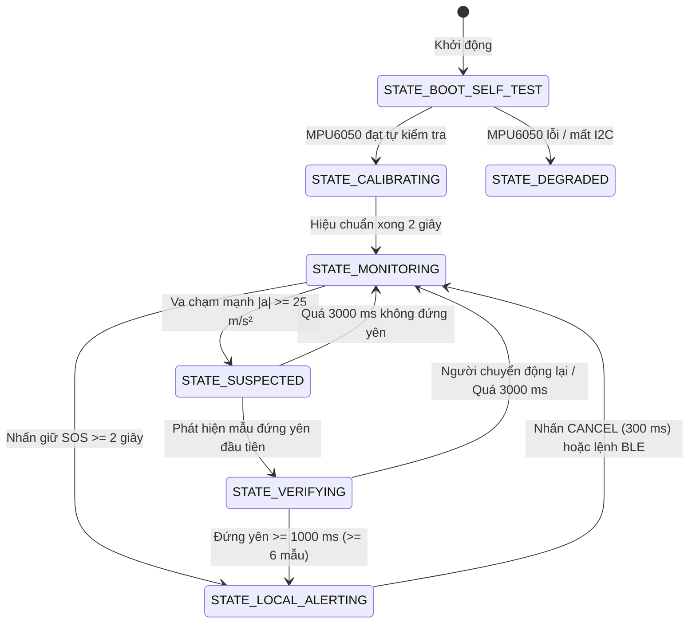

# HƯỚNG DẪN HỌC SINH — FIRMWARE ESP32-S3 PHÁT HIỆN TÉ NGÃ (NCKH27PA)

> **Mã nguồn:** [`esp-s3-for-student/esp-s3-for-student.ino`](esp-s3-for-student.ino) (1819 dòng mã C++/Arduino)  
> **Tài liệu đối chiếu tên tiếng Việt:** [`esp-s3-for-student/BANG-DOI-TEN.md`](BANG-DOI-TEN.md)  
> **Đối tượng:** Học sinh THPT tham gia nghiên cứu khoa học, lập trình nhúng IoT & vi điều khiển ESP32-S3.

---

## 1. Giới thiệu tổng quan

Firmware `esp-s3-for-student.ino` là phiên bản mã nguồn mở dành riêng cho học sinh học tập và thực hành, điều khiển thiết bị đeo thông minh phát hiện té ngã dựa trên vi điều khiển **ESP32-S3 Super Mini**.

```
 +-------------------------------------------------------------------------+
 |                            ESP32-S3 Super Mini                          |
 |                                                                         |
 |  [MPU6050 - I2C0]  --> Đọc gia tốc 3 trục (ax, ay, az) & con quay (g)   |
 |  [MS5611  - I2C1]  --> Đọc áp suất khí quyển & tính chênh lệch độ cao    |
 |                                                                         |
 |  -> Thuật toán phát hiện ngã: Va chạm mạnh -> Kiểm tra nằm yên          |
 |                                                                         |
 |  [BLE GATT 5.0]    --> Truyền dữ liệu cảm biến & sự kiện lên Android    |
 |  [Serial Console]  --> Giao diện dòng lệnh 115200 baud với 8 phím lệnh   |
 +-------------------------------------------------------------------------+
```

### Chức năng chính của Firmware:
1. **Thu thập dữ liệu chuyển động:** Đọc cảm biến quán tính 6 bậc tự do (IMU MPU6050) ở tần số cao (100 Hz hoặc 50 Hz).
2. **Thu thập dữ liệu độ cao:** Đọc cảm biến áp suất khí quyển MS5611 (GY-63) ở chế độ không chặn (non-blocking).
3. **Thuật toán phát hiện ngã 2 giai đoạn:** Nhận diện xung lực va chạm vượt ngưỡng $\ge 25.0\text{ m/s}^2$, sau đó mở cửa sổ 3000 ms để kiểm chứng trạng thái đứng yên bất động ($\ge 1000\text{ ms}$).
4. **Hai kênh giao tiếp song song:**
   - **Kênh BLE GATT:** Quảng bá tên `FALLSAFE-xxxx`, kết nối với ứng dụng Android FallSafe để truyền dữ liệu và nhận lệnh.
   - **Kênh Serial CLI:** Giao tiếp dòng lệnh trực tiếp qua cổng USB máy tính tốc độ 115200 baud để theo dõi, gỡ lỗi và thực hành.

---

## 2. Phần cứng và Sơ đồ đấu chân (Pinout)

Thiết bị sử dụng 2 bus I2C riêng biệt trên ESP32-S3 nhằm tránh xung đột tốc độ và tối ưu việc lấy mẫu:

| Tên ngoại vi / Chức năng | Chân ESP32-S3 | Bus I2C / Cấu hình | Trạng thái xác thực | Ghi chú kỹ thuật |
| :--- | :--- | :--- | :--- | :--- |
| **MPU6050 SDA** | `GPIO 8` | Bus 0 (`Wire`) | **ĐÃ XÁC THỰC** | Tần số 400 kHz, địa chỉ `0x68` (hoặc `0x69`) |
| **MPU6050 SCL** | `GPIO 9` | Bus 0 (`Wire`) | **ĐÃ XÁC THỰC** | Tần số 400 kHz, thang đo $\pm 16g$, $\pm 2000\text{ dps}$ |
| **MS5611 SDA** | `GPIO 7` | Bus 1 (`Wire1`) | **ĐÃ XÁC THỰC** | Tần số 400 kHz, địa chỉ `0x77` (hoặc `0x76`) |
| **MS5611 SCL** | `GPIO 6` | Bus 1 (`Wire1`) | **ĐÃ XÁC THỰC** | Tần số 400 kHz, độ phân giải OSR 4096 |
| **Nút SOS** | `GPIO 4` | `INPUT_PULLUP` | `TODO(HW)` | Mức THẤP (Active LOW), giữ $\ge 2000\text{ ms}$ để báo động |
| **Nút HỦY (CANCEL)** | `GPIO 5` | `INPUT_PULLUP` | `TODO(HW)` | Mức THẤP (Active LOW), giữ $\ge 300\text{ ms}$ để tắt còi |
| **Còi / Rung (Buzzer)** | `GPIO 1` | `OUTPUT` | `TODO(HW)` | Bật/tắt hoặc PWM cảnh báo khẩn cấp |
| **LED Trạng thái** | `GPIO 8` | `OUTPUT` | `TODO(HW)` | Nhấp nháy chỉ báo trạng thái hệ thống |
| **LED Báo Pin 1, 2, 3** | `GPIO 9, 10, 11` | `OUTPUT` | `TODO(HW)` | Dải 3 LED hiển thị mức pin |
| **Đo điện áp Pin (ADC)** | `GPIO 12` | `ADC` | `TODO(HW)` | Cầu phân áp đo pin LiPo |

> [!IMPORTANT]
> **Lưu ý về phần cứng đo pin, GNSS và 4G:**
> - Trong mã nguồn hiện tại, các cờ phần cứng `CO_DONG_HO_NHIEN_LIEU = 0`, `CO_GNSS = 0`, `CO_4G = 0`.
> - Do bo mạch **chưa lắp IC đo pin** (MAX17048 hoặc cầu phân áp ADC), giá trị phần trăm pin luôn báo giá trị lính canh là `-1` (tương ứng `BATTERY_READ_FAILED` trong gói tin), tuyệt đối không giả lập mức pin ảo 100%.

---

## 3. Cài đặt môi trường và Nạp chương trình

### Cách 1: Sử dụng Arduino IDE 2.x
1. Cài đặt **Arduino IDE 2.x** từ trang chủ Arduino.
2. Mở *Preferences* (Cài đặt), thêm URL bo mạch ESP32 vào ô *Additional boards manager URLs*:
   ```
   https://espressif.github.io/arduino-esp32/package_esp32_index.json
   ```
3. Mở *Boards Manager*, tìm kiếm và cài đặt gói **esp32** (khuyên dùng bản `3.0.x` trở lên).
4. Mở tệp [`esp-s3-for-student/esp-s3-for-student.ino`](esp-s3-for-student.ino).
5. Trong menu **Tools**:
   - **Board:** Chọn `ESP32S3 Dev Module`.
   - **USB CDC On Boot:** Chọn `Enabled` (cực kỳ quan trọng để Serial hoạt động qua USB gốc).
   - **USB Mode:** Chọn `Hardware CDC and JTAG`.
   - **Flash Size:** `4MB`.
   - **PSRAM:** `Disabled`.
   - **Port:** Chọn đúng cổng USB của bo (trên macOS có dạng `/dev/cu.usbmodem*`, trên Windows có dạng `COM*`).
6. Nhấn nút **Upload** (mũi tên sang phải) để biên dịch và nạp.

### Cách 2: Sử dụng công cụ dòng lệnh `arduino-cli`
Chạy lệnh sau trong Terminal:
```bash
# Biên dịch chương trình với cấu hình FQBN chuẩn:
arduino-cli compile \
  --fqbn "esp32:esp32:esp32s3:USBMode=hwcdc,CDCOnBoot=cdc,FlashSize=4M,PSRAM=disabled" \
  esp-s3-for-student

# Nạp chương trình vào bo mạch (thay /dev/cu.usbmodem1101 bằng cổng thực tế):
arduino-cli upload \
  -p /dev/cu.usbmodem1101 \
  --fqbn "esp32:esp32:esp32s3:USBMode=hwcdc,CDCOnBoot=cdc,FlashSize=4M,PSRAM=disabled" \
  esp-s3-for-student
```

### Cảnh báo ngân sách bộ nhớ Flash (Program Memory):
Do firmware tích hợp đầy đủ thư viện **Bluetooth BLE** (`BLEDevice`), **WiFi**, xử lý toán học và máy trạng thái, dung lượng bộ nhớ chương trình chiếm **khoảng 88% Flash (gần chạm trần)**. Khi viết thêm tính năng, học sinh cần lưu ý tránh khai báo mảng tĩnh quá lớn để không bị tràn bộ nhớ.

---

## 4. Giao diện Serial Monitor & Bảng 8 Phím Lệnh

Mở **Serial Monitor** trên Arduino IDE hoặc dùng phần mềm terminal (như PuTTY, screen) với cấu hình:
- **Tốc độ Baud:** `115200`
- **Line Ending:** `Both NL & CR` hoặc `Newline`

Khi khởi động, firmware chạy ở chế độ **Dễ đọc (Human Mode)** với tần suất in khoảng 4 dòng/giây (mỗi 250 ms):
```text
[T=012345 ms] Trang thai: MONITORING     | |a|:  9.81 m/s^2 | Chenh cao:   0.05 m | BLE: QUANG_BA
```

### Bảng 8 phím lệnh tương tác (gõ trực tiếp vào Serial Monitor):

| Phím | Tên chức năng | Mô tả hoạt động | Đầu ra mẫu từ mã nguồn |
| :---: | :--- | :--- | :--- |
| `m` / `M` | **In MENU** | In toàn bộ menu 8 phím lệnh trợ giúp | Khối `===== MENU =====` |
| `h` / `H` | **Trợ giúp (Help)** | In trợ giúp danh sách lệnh CLI ngắn gọn | Khối `--- TRO GIUP CLI SERIAL ---` |
| `r` / `R` | **Bật/Tắt CSV thô** | Chuyển qua lại giữa dạng dễ đọc và dạng CSV | `timestamp_ms,ax,ay,az,mag,gx,gy,gz,pressure_pa,altitudeDeltaM,state,event` |
| `t` / `T` | **Bảng ngưỡng** | In toàn bộ tham số phát hiện ngã đang cấu hình | Bảng `CAU HINH PHAT HIEN TE NGA NCKH27PA ESP32-S3` |
| `s` / `S` | **Trạng thái hệ thống**| Báo cáo chi tiết cảm biến, WiFi, BLE, bộ đệm, RAM | Khối `--- TRANG THAI HE THONG THIET BI ---` |
| `c` / `C` | **Chạy lại hiệu chuẩn**| Tự kiểm tra phần cứng & lấy mốc đứng yên 2 giây | `[CALIB] Dang hieu chuan sai so con quay...` |
| `p` / `P` | **Khối TIẾN TRÌNH** | Xem tiến trình 6 bước và vị trí bước hiện tại | Khối `========== KHOI TIEN TRINH ==========` |
| `d` / `D` | **Bật/Tắt Nhịp tim** | Bật hoặc tắt dòng in nhịp tim định kỳ mỗi 5 giây | `[NHIP TIM] Thoi gian chay: 15.0 s | Trang thai: MONITORING...` |

### Ví dụ đầu ra thực tế từ mã nguồn:

#### 1. Khối Tiến trình (gõ phím `p`):
```text
========== KHOI TIEN TRINH ==========
 [x] 1. BOOT / TU KIEM TRA
 [x] 2. HIEU CHUAN       
 [>] 3. THEO DOI           <== dang o buoc nay
 [ ] 4. NGHI NGA         
 [ ] 5. XAC MINH         
 [ ] 6. BAO DONG         
=====================================
```
*(Nếu thiết bị thiếu cảm biến MPU6050, dòng cảnh báo sau sẽ xuất hiện: `[!] CANH BAO: thiet bi dang SUY GIAM (thieu cam bien)`)*

#### 2. Dòng Nhịp tim định kỳ (tự động in mỗi 5 giây khi bật phím `d`):
```text
[NHIP TIM] Thoi gian chay: 25.0 s | Trang thai: MONITORING | Mau trong bo dem: 1000 | Mau bi bo: 0 | Pin: chua co pin | WiFi: chua ket noi
```

#### 3. Bảng trạng thái hệ thống (gõ phím `s`):
```text
--- TRANG THAI HE THONG THIET BI ---
Ma thiet bi: FALLSAFE-3A1B | Phan mem: esp-s3 1.0.0
Trang thai: MONITORING (Truoc do: CALIBRATING)
IMU MPU6050: ONLINE (dia chi: 0x68, bao hoa: NO, tan so: 100 Hz)
Khi ap ke MS5611: ONLINE (dia chi: 0x77, CRC: VALID, moc: 101325.0 Pa)
BLE: DA NGAT KET NOI (Dang truyen: TAT) | MTU: 23
WiFi: DA NGAT KET NOI (SSID: Pdmq)
Bo dem: 1000/1000 mau (100%) | Bi bo: 0
Bo dem: IMU=2540, KhiAp=127, Tre=0, Nga=0, SOS=0, BLE bi bo=0
Pin: -1% (chua lap = -1), Heap trong: 312450 byte
Ma loi cuoi: BATTERY_READ_FAILED
-----------------------------
```

---

## 5. Sáu Bước Tiến trình Hoạt động của Thiết bị

Thiết bị vận hành theo mô hình máy trạng thái hữu hạn gồm 6 bước chính cùng 1 trạng thái suy giảm bảo vệ phần cứng:



### Chi tiết 6 bước tiến trình:
1. **Bước 1: `STATE_BOOT_SELF_TEST` (BOOT / TỰ KIỂM TRA):**
   - Quét bus I2C0 tìm MPU6050 (`0x68`/`0x69`) và bus I2C1 tìm MS5611 (`0x77`/`0x76`).
   - Kiểm tra mã chip WHO_AM_I và tính toàn vẹn CRC4 của PROM khí áp.
2. **Bước 2: `STATE_CALIBRATING` (HIỆU CHUẨN):**
   - Yêu cầu đặt thiết bị nằm yên trong 2 giây để đo độ lệch con quay (`saiSoVanTocGoc`) và vectơ trọng lực gốc (`trongLucGocX, Y, Z`).
   - Lấy áp suất trung bình làm mốc độ cao 0m (`apSuatThamChieuPa`).
3. **Bước 3: `STATE_MONITORING` (THEO DÕI):**
   - Giám sát liên tục ở 100 Hz, ghi dữ liệu vào bộ đệm vòng 1000 mẫu (lưu trữ lịch sử 10 giây trước sự kiện).
   - Tự động bù trôi áp suất mốc nếu áp suất môi trường ổn định trong $\pm 10\text{ Pa}$ liên tục 10 giây.
4. **Bước 4: `STATE_SUSPECTED` (NGHI NGÃ):**
   - Kích hoạt ngay khi độ lớn gia tốc $|\vec{a}| \ge 25.0\text{ m/s}^2$. Mở cửa sổ theo dõi 3000 ms.
5. **Bước 5: `STATE_VERIFYING` (XÁC MINH):**
   - Kiểm tra xem người đeo có nằm bất động hay không bằng cách đối chiếu $|\vec{a}|$ quanh $9.81\text{ m/s}^2$ với dung sai $\pm 1.0\text{ m/s}^2$.
6. **Bước 6: `STATE_LOCAL_ALERTING` (BÁO ĐỘNG CỤC BỘ):**
   - Khi xác nhận ngã: Còi kêu ngắt quãng và LED nháy đồng bộ (200 ms bật / 200 ms tắt).
   - Đồng thời phát gói sự kiện `INACTIVITY_DETECTED` qua BLE tới ứng dụng điện thoại.

> [!WARNING]
> **Trạng thái `STATE_DEGRADED` (SUY GIẢM):**  
> Trạng thái này đứng ngoài 6 bước thông thường. Khi MPU6050 mất kết nối hoặc bị lỗi liên tiếp 10 chu kỳ, firmware chuyển sang `STATE_DEGRADED`, LED trạng thái nhấp nháy nhanh (125 ms bật / 125 ms tắt) và gửi cảnh báo `SENSOR_ERROR` qua BLE.

---

## 6. Giải thích Thuật toán Phát hiện Ngã & Các Ngưỡng Số Học

Mọi ngưỡng số học trong mã nguồn được thiết lập chính xác theo cấu hình chuẩn y tế và thực nghiệm (`Android FallDetectionConfig.DEFAULT`):

```
 Gia tốc |a|
    ^
    |       [ĐỈNH VA CHẠM]
    |          /\ >= 25.0 m/s²
    |         /  \
    |--------/----\------------------------------------------ Ngưỡng va chạm (25.0 m/s²)
    |       /      \
    |  ~~~ /        \       [GIAI ĐOẠN ĐỨNG YÊN]
9.81+----------------\~~~~~======================~~~~~~~~~~~~ Ngưỡng đứng yên (9.81 ± 1.0 m/s²)
    |                     |<--- >= 1000 ms ---->|
    |                     | (tối thiểu 6 mẫu)   |
    +---------------------+---------------------+-----------> Thời gian (ms)
                      Va chạm              Xác nhận ngã
                      (t = 0)              (t <= 3000 ms)
```

| Tên biến trong mã nguồn | Giá trị chuẩn | Ý nghĩa vật lý và Lý do chọn số |
| :--- | :---: | :--- |
| `giaTocVaChamMs2` | `25.0f` ($\text{m/s}^2$) | **Ngưỡng gia tốc va chạm:** Khi ngã đập xuống sàn, cơ thể chịu xung lực lớn (tương đương $>2.5g$). Các hoạt động bình thường (đi bộ, ngồi nhanh) hiếm khi vượt $20\text{ m/s}^2$. |
| `nguongDungYenMs2` | `9.81f` ($\text{m/s}^2$) | **Gia tốc mục tiêu khi nằm yên:** Bằng đúng gia tốc trọng trường $g = 9.80665\text{ m/s}^2$. Khi bất động, chỉ có trọng lực tác động lên cảm biến. |
| `nguongSaiSoDungYenMs2`| `1.0f` ($\text{m/s}^2$) | **Dung sai đứng yên:** Cho phép sai lệch từ $8.81$ đến $10.81\text{ m/s}^2$ để khử nhiễu run rẩy sinh học của cơ thể hoặc nhịp thở. |
| `cuaSoSauVaChamMs` | `3000` (ms) | **Cửa sổ thời gian sau va chạm:** Sau khi ngã đập, trong vòng tối đa 3 giây nạn nhân phải rơi vào trạng thái nằm bất động. Nếu sau 3 giây vẫn chuyển động mạnh thì hủy nghi ngờ ngã. |
| `thoiGianDungYenSauVaChamMs`| `1000` (ms) | **Thời gian đứng yên tối thiểu:** Nạn nhân phải nằm yên liên tục ít nhất 1 giây (1000 ms) mới xác nhận là bất tỉnh hoặc mất khả năng đứng dậy. |
| `minimumStillnessSamples` | `6` (mẫu) | **Số mẫu đứng yên liên tục:** Tránh trường hợp tín hiệu gia tốc vô tình đi ngang qua mức $9.81\text{ m/s}^2$ trong tích tắc khi đang cử động. |
| `maximumSampleGapMs` | `250` (ms) | **Khoảng cách mẫu tối đa:** Nếu 2 mẫu cách nhau $>250\text{ ms}$ (do hệ thống nghẽn), chuỗi xác minh bị hủy để đảm bảo độ tin cậy. |
| `nguongThayDoiTuTheDo` | `45.0f` (độ) | **Góc đổi tư thế:** Tính qua tích vô hướng $\arccos\left(\frac{\vec{g}_{\text{trước}} \cdot \vec{a}_{\text{sau}}}{|\vec{g}||\vec{a}|}\right)$. Khi người từ tư thế đứng chuyển sang nằm, vectơ trọng lực xoay $>45^\circ$, cộng thêm $+10$ điểm tin cậy. |
| `nguongTuDoMs2` | `3.0f` ($\text{m/s}^2$) | **Ngưỡng rơi tự do:** Nếu trước va chạm gia tốc sụt dưới $3.0\text{ m/s}^2$ (cơ thể rơi tự do không trọng lượng), cộng thêm $+5$ điểm tin cậy. |

---

## 7. Giao thức Truyền thông BLE GATT

Thiết bị đóng vai trò **BLE GATT Server** và quảng bá tên dạng `FALLSAFE-xxxx` (trong đó `xxxx` là 2 byte cuối của địa chỉ MAC Bluetooth).

### Danh sách UUID Dịch vụ & Đặc trưng:
- **Service UUID chính:** `7d2a0001-6f45-4c2b-9a1e-38a8f5c10001`

| Đặc trưng | UUID | Thuộc tính BLE | Mục đích sử dụng |
| :--- | :--- | :---: | :--- |
| `Stream` | `7d2a0002-6f45-4c2b-9a1e-38a8f5c10001` | **Notify** | Truyền luồng dữ liệu cảm biến thời gian thực (~25 Hz) |
| `Event` | `7d2a0003-6f45-4c2b-9a1e-38a8f5c10001` | **Indicate** | Phát sự kiện cảnh báo ngã, SOS, pin yếu, lỗi cảm biến |
| `Status` | `7d2a0004-6f45-4c2b-9a1e-38a8f5c10001` | **Read / Notify** | Đọc hoặc cập nhật trạng thái thiết bị định kỳ (5 giây) |
| `Command` | `7d2a0005-6f45-4c2b-9a1e-38a8f5c10001` | **Write** | Nhận lệnh điều khiển dạng JSON từ ứng dụng Android |
| `Command ACK` | `7d2a0006-6f45-4c2b-9a1e-38a8f5c10001` | **Notify** | Trả kết quả xác nhận sau khi thực hiện lệnh |

---

### Định dạng các gói tin JSON thực tế:

#### 1. Gói Dữ liệu Cảm biến (`Esp32SensorPacket` qua `Stream 0002`):
```json
{
  "protocolVersion": 1,
  "deviceId": "FALLSAFE-3A1B",
  "sequenceNumber": 1042,
  "timestampMs": 1789363200123,
  "accelXMs2": 0.12,
  "accelYMs2": 0.35,
  "accelZMs2": 9.78,
  "gyroXDps": 1.2,
  "gyroYDps": -0.5,
  "gyroZDps": 0.1,
  "pressurePa": 101320.5,
  "temperatureC": 28.4,
  "altitudeDeltaM": 0.38,
  "batteryPercent": -1,
  "batteryVoltageMv": null,
  "isCharging": false,
  "sosButtonPressed": false,
  "sensorQuality": 100
}
```

#### 2. Gói Sự kiện Té ngã / SOS (`Esp32EventPacket` qua `Event 0003`):
```json
{
  "protocolVersion": 1,
  "eventId": "evt-A1F4-0001",
  "deviceId": "FALLSAFE-3A1B",
  "sequenceNumber": 1043,
  "timestampMs": 1789363200123,
  "eventType": "INACTIVITY_DETECTED",
  "eventSeverity": "CRITICAL",
  "sosButtonPressed": false,
  "eventConfidence": 95,
  "peakAccelerationMs2": 28.45,
  "orientationChangeDeg": 78.5,
  "altitudeDeltaM": -0.82,
  "inactivityDurationMs": 1020,
  "checksum": null,
  "triggerReasons": ["IMPACT_28.5,FREE_FALL"]
}
```

#### 3. Gói Lệnh Điều khiển từ Android (`Esp32Command` ghi vào `Command 0005`):
Mọi lệnh gửi xuống thiết bị **bắt buộc phải là chuỗi JSON hợp lệ**:
```json
{
  "protocolVersion": 1,
  "commandId": "cmd-101",
  "commandType": "START_STREAM"
}
```
*Danh sách các `commandType` hỗ trợ:*
- `PING`: Trả lời `"message":"PONG"`.
- `GET_STATUS`: Yêu cầu gửi ngay gói `Esp32DeviceStatus`.
- `START_STREAM` / `STOP_STREAM`: Bật / Tắt truyền dữ liệu cảm biến định kỳ.
- `SET_SAMPLE_RATE`: Đổi tần số lấy mẫu (`"sampleRateHz": 100` hoặc `50`).
- `SET_REFERENCE_ALTITUDE`: Lấy áp suất hiện tại làm mốc 0m.
- `TRIGGER_BUZZER`: Bật còi báo (kèm tham số `"remainingMs": 2000`).
- `STOP_BUZZER`: Tắt còi ngay lập tức.
- `ACK_EVENT`: Xác nhận đã nhận sự kiện (giữ nguyên còi cục bộ).
- `CANCEL_ALERT`: Tắt còi và đưa thiết bị về lại trạng thái `MONITORING`.
- `START_SELF_TEST`: Chạy lại tự kiểm tra và hiệu chuẩn.
- `SET_DEVICE_TIME`: Đồng bộ thời gian Unix (`"unixTimeMs": 1789363200123`).
- `REBOOT_DEVICE`: Khởi động lại vi điều khiển (bị từ chối nếu đang có báo động).

> [!CAUTION]
> Nếu gửi chuỗi văn bản thô (không phải JSON) hoặc tên lệnh sai, thiết bị sẽ phản hồi gói ACK từ chối với mã lỗi `UNKNOWN_COMMAND`:
> `{"commandStatus":"REJECTED","errorCode":"UNKNOWN_COMMAND","message":"Khong nhan dang duoc lenh"}`.

---

## 8. Kết nối Thiết bị với Ứng dụng Android FallSafe

1. **Bật Bluetooth và Vị trí** trên điện thoại Android.
2. Mở ứng dụng **FallSafe**.
3. Chọn màn hình **Quét thiết bị (Scan)**: Ứng dụng sẽ tìm thấy thiết bị có tên bắt đầu bằng `FALLSAFE-` (ví dụ `FALLSAFE-3A1B`).
4. Nhấn **Kết nối (Connect)**: Ứng dụng sẽ tự động thương lượng MTU (tối đa 517 byte), đăng ký lắng nghe (Subscribe Notify/Indicate) trên các đặc trưng Stream, Event, Status và ACK.

> [!NOTE]
> **Lưu ý quan trọng về tính năng "Gửi Profile":**  
> Trên giao diện ứng dụng Android có nút *"Gửi Profile"* (để cấu hình lại ngưỡng phát hiện ngã). Tuy nhiên, **firmware hiện tại chưa hỗ trợ ghi profile qua BLE** vì đặc trưng `7d2a0006` là đặc trưng Command ACK chỉ-Notify (chỉ gửi phản hồi từ ESP32 lên điện thoại, không nhận ghi cấu hình profile). Cấu hình phát hiện ngã trên bo mạch hiện đang dùng bộ ngưỡng mặc định tối ưu trong mã nguồn.

---

## 9. Bộ Câu hỏi & Bài tập Thực hành cho Học sinh

Hãy mở tệp mã nguồn [`esp-s3-for-student.ino`](esp-s3-for-student.ino) và trả lời các câu hỏi sau:

### Bài tập 1: Cơ chế đa nhiệm không chặn (Non-blocking)
*Tại sao trong toàn bộ hàm `loop()` của firmware, tác giả lại sử dụng `millis()` và `micros()` để định thời thay vì dùng lệnh `delay(10)`? Điều gì sẽ xảy ra với nút bấm SOS và gói tin BLE nếu chúng ta đặt `delay(2000)` trong `loop()`?*

### Bài tập 2: Tần số lấy mẫu IMU và thanh ghi MPU6050
*Trong hàm `xuLyLenhBle()`, khi nhận lệnh `SET_SAMPLE_RATE` với tần số 50 Hz, giá trị thanh ghi `MPU6050_SMPLRT_DIV` được ghi là bao nhiêu (xem dòng 1410–1411)? Hãy giải thích công thức chia tần số từ xung nhịp gốc 1 kHz của MPU6050.*

### Bài tập 3: Quản lý kích thước gói tin BLE và MTU
*Trong các hàm gửi dữ liệu BLE (`guiBleAck`, `guiBleSuKien`, `guiBleDuLieuCamBien`), đoạn mã luôn có điều kiện kiểm tra:*
```cpp
if (strlen(boDem) > (size_t)(mtuBle - 3)) { boDemHeThong.goiBleBiBo++; return; }
```
*Tại sao kích thước chuỗi JSON phải nhỏ hơn `mtuBle - 3`? Con số 3 byte này dành cho thành phần nào trong giao thức ATT của Bluetooth BLE?*

### Bài tập 4: Trọng lực và góc thay đổi tư thế
*Hãy tìm đoạn mã tính toán `thayDoiGocDo` (dòng 1308–1320). Thuật toán đã sử dụng công thức toán học nào (tích vô hướng hay tích có hướng) giữa vectơ trọng lực trước va chạm và vectơ gia tốc sau va chạm để tính ra góc nghiêng của người đeo?*

### Bài tập 5: Thực hành Serial Monitor
*Hãy kết nối bo ESP32-S3 với máy tính, mở Serial Monitor ở tốc độ 115200 baud:*
1. Gõ phím `t` để kiểm tra bảng ngưỡng.
2. Cầm bo mạch mô phỏng một cú rơi và đập mạnh xuống bàn (hoặc đệm tay) rồi giữ yên bo mạch. Quan sát Serial Monitor chuyển từ `MONITORING` $\to$ `SUSPECTED` $\to$ `VERIFYING` $\to$ `LOCAL_ALERTING`.
3. Nhấn phím `p` để xem khối tiến trình 6 bước tại thời điểm báo động.
4. Giữ chân GPIO 5 (Nút HỦY) nối đất (GND) trong $>300\text{ ms}$ hoặc gửi lệnh `CANCEL_ALERT` để tắt báo động.

---

## 10. Bảng Tra cứu Nhanh Định danh Tiếng Việt

Tất cả các biến toàn cục và hàm nghiệp vụ trong firmware học sinh đã được Việt hóa không dấu theo chuẩn [`BANG-DOI-TEN.md`](BANG-DOI-TEN.md). Dưới đây là 10 ví dụ tiêu biểu:

| Tên gốc trong C++ (`esp-s3.ino`) | Tên tiếng Việt (`esp-s3-for-student.ino`) | Ý nghĩa & Chức năng |
| :--- | :--- | :--- |
| `s_state` | `trangThaiThietBi` | Trạng thái hoạt động chính của máy trạng thái thiết bị |
| `s_mpu` | `camBienMpu` | Biến cấu trúc quản lý driver cảm biến quán tính MPU6050 |
| `s_baro` | `camBienKhiAp` | Biến cấu trúc quản lý driver cảm biến áp suất khí quyển MS5611 |
| `s_ringBuffer` | `boDemVong` | Mảng bộ đệm vòng lưu trữ 1000 mẫu cảm biến (10 giây) |
| `s_batteryPercent` | `phanTramPin` | Phần trăm pin còn lại (giá trị `-1` khi chưa lắp IC đo) |
| `sendBleEvent` | `guiBleSuKien` | Hàm đóng gói JSON và phát sự kiện cảnh báo qua BLE |
| `sendBleAck` | `guiBleAck` | Hàm gửi gói tin xác nhận thực thi lệnh cho ứng dụng |
| `PIN_BUZZER` | `CHAN_CANH_BAO` | Hằng số chân GPIO điều khiển còi báo động (`GPIO 1`) |
| `PROFILE_DEFAULT` | `NGUONG_PHAT_HIEN_TE_NGA` | Cấu hình hằng số các ngưỡng phát hiện ngã chuẩn |
| `inactivityDurationMs` | `thoiGianKhongHoatDongMs` | Thời gian người đeo nằm bất động liên tục sau va chạm (ms) |

---
*Tài liệu thuộc dự án Nghiên cứu Khoa học NCKH27PA — Chúc các em học sinh học tập và nghiên cứu hiệu quả!*
